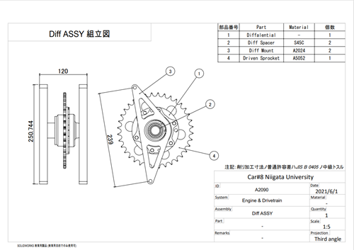
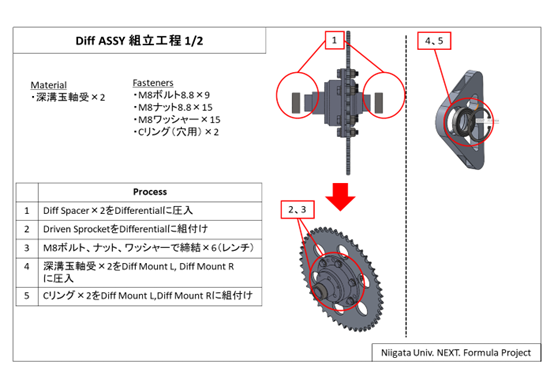
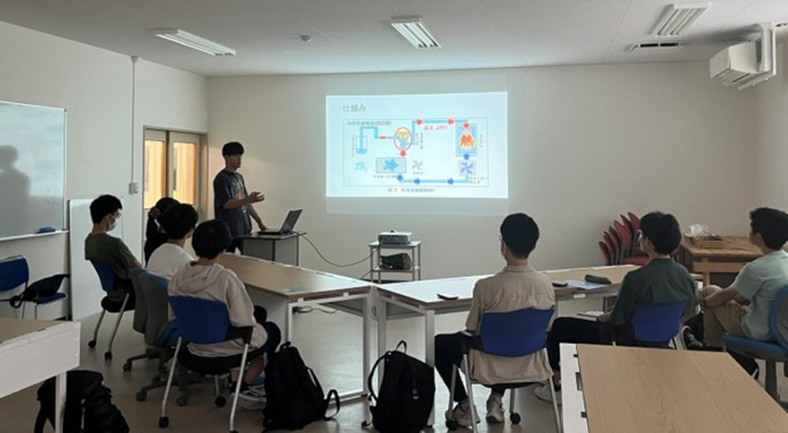
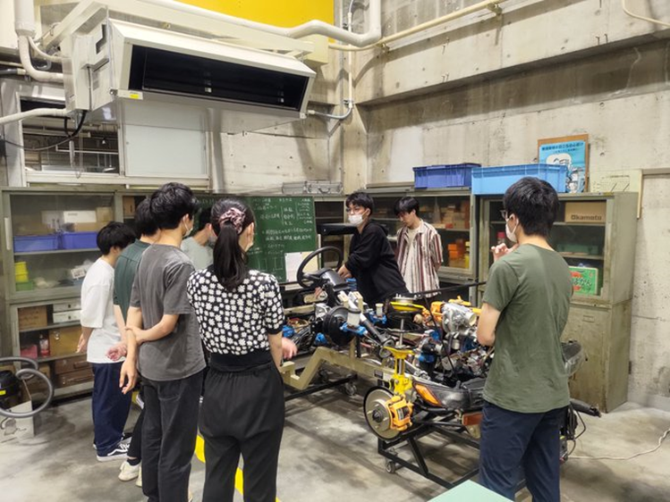

# 6 月活動報告

パワポのスライド版活動報告はここで閲覧できます。  
https://www.slideshare.net/secret/LA06l5bGQj69Lb

## 学生フォーミュラ日本大会について

私たちが出場する全日本学生フォーミュラ選手大会の審査項目は、静的審査と動的審査の大きく 2 種類に分かれております。
おもに静的では、学生の設計者としての能力を動的では、技術者としての能力を判断される審査となっております。

 
 

## マシンの進捗

6 月 10 日と 6 月 29 日にエンジンを行いました。  
5 月のエンジン始動では異常が見られませんでしたが、6 月 10 日は異音が発生しエンジンメンテナンスを行い、6 月 29 日は電装トラブルによりエンジンを始動することはできませんでした。  
そのため、6 月に予定していたシェイクダウンを延長し、次のエンジン始動に向けて調整を進めています。

 
 

## 静的審査

6 月 1 日にコスト審査資料の提出が完了しました。  
コスト審査とは、私たちのマシンを作る場合どのくらいの金額がかかるのかを、部品代から手間賃まですべて計算し、その金額の安さと資料のクオリティーを競う審査です。

  

さらに、6月15日にはプレゼン審査の資料を6月22日にはプレゼン審査のSPDの提出を完了致しました。  
プレゼン審査とはをもし私たちのマシンを大量生産し販売するとしたら、どのような戦略で販売するかを世界情勢に則った毎年出されるお題を基に考え発表するという審査です。

 
 

## 新入生育成

6 月 12 日に設計概論、15 日に学生フォーミュラ概論、19 日と 22 日パワトレ概論、26 日シャシー概論を行いました。  
設計概論はマシン設計に必要な基礎知識の習得を目的とし行いました。そこで新入生にはある子供用の遊具にかかる強度計算を行ってもらい、その強度に合うボルトを選定し、ボルトを締め付けるためのスパナを CAD で設計するという課題を出しました。  
学生フォーミュラ概論では、学生フォーミュラ大会の説明を行いました。  
パワトレ・シャシー概論では、パワトレ系、シャシー系に分けてマシン知識の習得を目的として行いました。

  

 
 

## その他

ガクセイフォーミュラジェーピー様に取材していただきました。

<blockquote class="twitter-tweet" data-dnt="true">
新潟大学 <a href="https://twitter.com/NEXT_Formula?ref_src=twsrc%5Etfw">@NEXT_Formula</a> と富山大学 <a href="https://twitter.com/Toyama_TUF?ref_src=twsrc%5Etfw">@Toyama_TUF</a> を取材し、これでちょうど50チームを数えることができました！ ありがとうございました❗️ <a href="https://t.co/aqIIYlXayp">pic.twitter.com/aqIIYlXayp</a>
&mdash; ガクセイフォーミュラジェーピー - 学生フォーミュラ専門メディア (@GakuF_JP) <a href="https://twitter.com/GakuF_JP/status/1671434799125499905?ref_src=twsrc%5Etfw">June 21, 2023</a></blockquote> 

 
 

## スポンサー提供

### 株式会社和光ケミカル様(http://wako-chemical.co.jp)

シャシーブラックとメカタオルのご提供をいただきました。

 

### 株式会社ニフコ様(http://nifco.com)

タイラップとプッシュピンのご提供をいただきました

 

### 小林製作所様（https://kobayashi-weld.com）

純チタンで制作した排気パーツのご提供を頂きました

